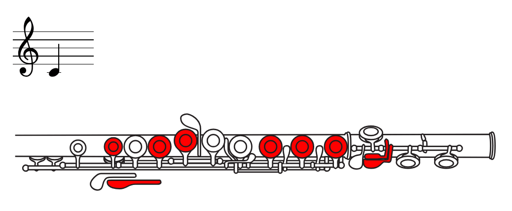

# flute-fingering-p5js

Interactively displays flute fingering using [P5.js SVG](https://github.com/zenozeng/p5.js-svg) and [ABC.js](https://paulrosen.github.io/abcjs/)

https://ffunatsu.github.io/flute-fingering-p5js/

## Usage

- Click (Tap) upper part: Tone up
- Click (Tap) lower part: Tone down

## License

Flute fingering SVG (and fingering information) is used from https://www.yamaha.com/ja/musical_instrument_guide/common/images/flute/fingering.pdf 

So please consider this script is just utility for it, and treat as NOT open sourced. 
Just use for your hobby usage.